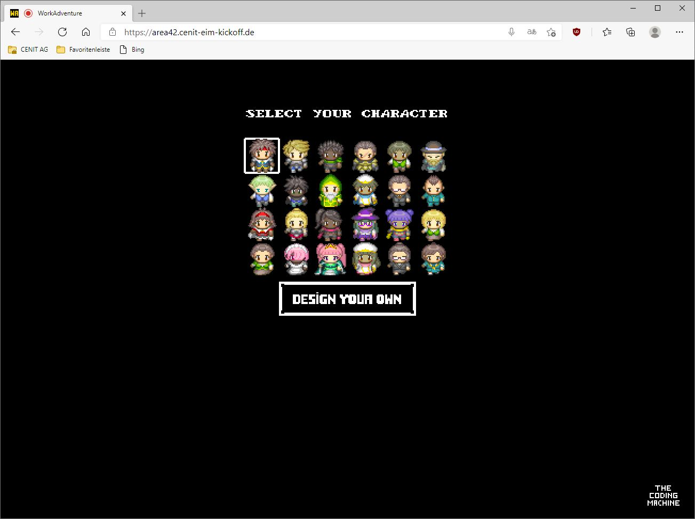

# CENIT Developer Days 2021

## Overview

Welcome to the CENIT Developer Days 2021, an event that will take place online this year. For this we have generated a [virtual world](https://area42.eim.cloud-cenit.com) in the 16bit style of video games of the 80s/90s. The name of this new World is Area42.

Here you can transfer to [Area42](https://area42.eim.cloud-cenit.com)

## System Requirements

* To use the virtual world you must use Microsoft's Edge browser (at least version 88.0.705.68).
* Furthermore, you should allow access to your microphone and camera when logging in.
* It is especially important that you disconnect your VPN connection to CENIT.

## Support

If you have problems accessing or using the virtual world, you can use Teams [Support Teams Room](https://teams.microsoft.com/l/meetup-join/19%3ameeting_MjNjN2IyNTQtMjIxYy00NjMxLThhMTEtY2RhMjdjYjEwMDBh%40thread.v2/0?context=%7b%22Tid%22%3a%22ce368477-a736-4353-b4ef-741ef2740d36%22%2c%22Oid%22%3a%2258ac232b-c98c-4183-bc51-e62bef9f8148%22%7d"). Here Dirk Günther and Helge Schneider will help you. You can also chat with them directly in teams.

## Access

If you go to the [Virtual World](https://area42.eim.cloud-cenit.com), you should find the following....

Here you can enter your name for your virtual avatar (your visual representation in the virtual world).

Also, your browser should ask you if you want to share your microphone....

Please agree here so you can talk to everyone else in the virtual world.

Then you can choose a character (your visual representation in the virtual world)...

Finally, you should release your camera...

And then you're ready to go...